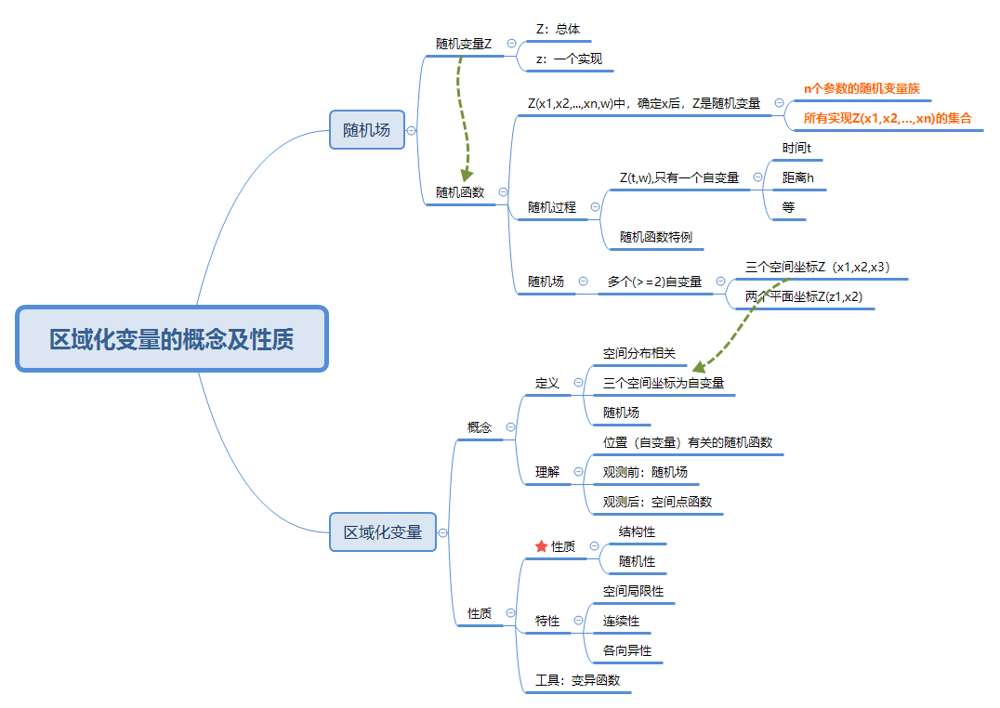
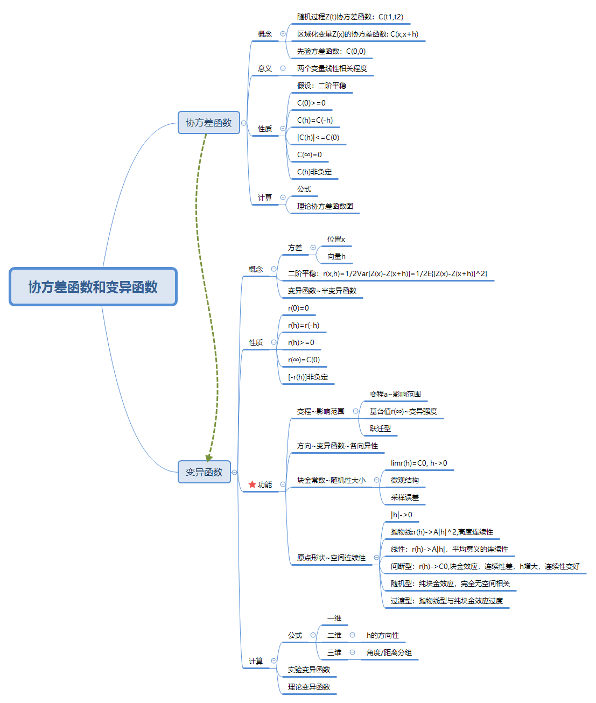
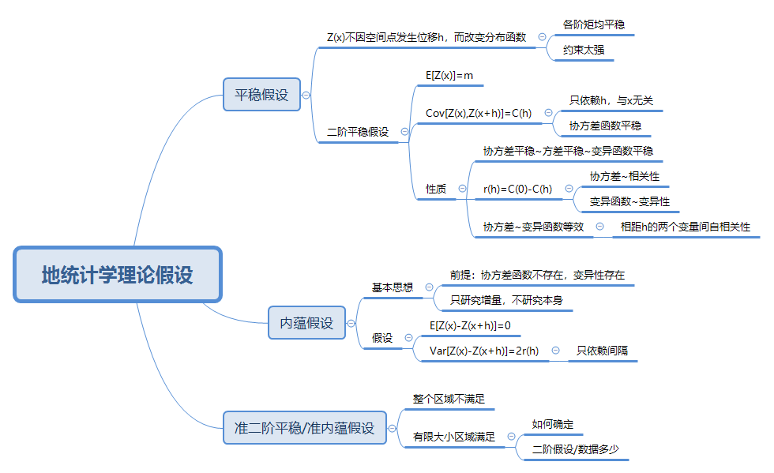
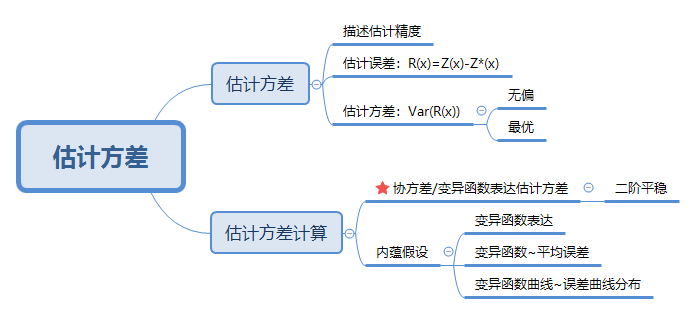

区域变量理论建立在随机场理论的基础上，而变异函数是描述区域变量的有力工具，变异函数与协方差函数其实本质相同，由协方差函数推导而来。这一章的内容环环相扣。

### 1. 区域化变量概念
区域化变量函数Z(x,y,z,w)就是建立在空间维度的随机场，函数分布与空间位置关系有关。空间位置确定后，Z(x,y,z)为该位置的随机变量，Z值确定后，即为该随机变量的一个实现。

随机过程为一维的随机函数，随机场就是多维的随机函数而已。

### 2. 协方差函数与变异函数

在二阶平稳假设下，协方差函数就是关于距离h的随机函数，与空间位置x无关，用来描述研究范围的相关性。变异函数用来描述研究范围的变异性。这两个函数此消彼长，有简单的函数关系，其实实质类似。

变异函数的一些性质都需要协方差函数来进行描述，如基台值。变异函数在地统计中地位很重要，本章只是介绍了一些性质，和在原点处的几种形态，具体如何对区域变量的性质进行描述还未深入讨论。

### 3. 地统计学理论假设

在上面讨论协方差函数和变异函数的时候就是在相关理论假设条件下进行的。

平稳性-二阶平稳性-内蕴假设-准二阶平稳/准内蕴假设，对实际数据的约束力依次减小。

平稳性要求各阶矩都平稳；二阶平稳要求*数学期望*为常数，*协方差*只与间距h相关，与具体的空间位置无关；内蕴假设，为*协方差*不存在时，只讨论空间距离差值的平稳性；准二阶平稳/内蕴假设，适用于有限空间大小，而整个研究区域可能不满足假设，存在如何确定该空间大小的问题。

### 4. 估计方差

用来评估估值的精度问题，类似与统计中的均方根误差。在地统计理论假设下，其计算公式用协方差或变异函数表示，两者等价。

### 小结
本章只是在对区域化变量理论相关内容进行了整理，还未涉及到具体如何应用，如空间位置的估值，精度如何计算，空间性质如何判断，变异函数形式如何，等。期待下一章，看到底在区域化变量理论基础上如何和实际相联系，其方法的局限性又有哪些（理论假设？）。