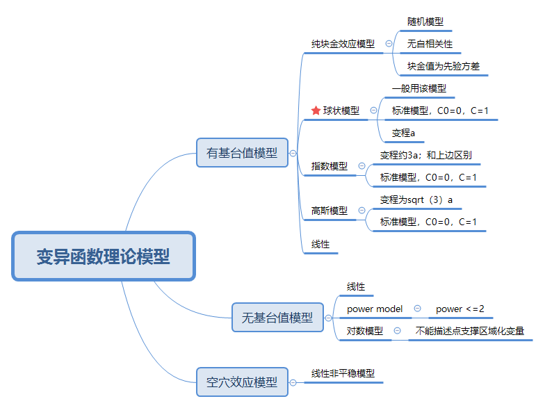
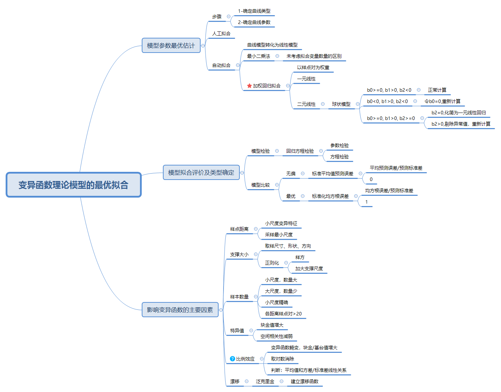
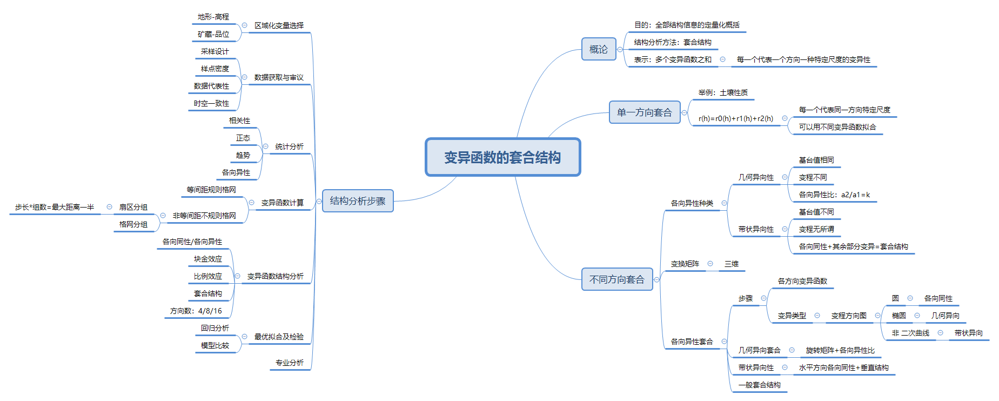

上一节主要是对区域化变量理论基础，基本概念，数学方法，和理论假设做了介绍。本节针对描述区划化变量的主要工具——变异函数进行分析，主要包括变异函数的理论模型，拟合方法，结构分析等方面进行介绍。由于实验数据有限，不可能覆盖全部情况，因此充分利用有限的数据建立实验变异函数并对理论模型进行无偏最优推断，这一过程是统计推断在区域化变量上的具体实现。

#### 1. 变异函数的理论模型

理论模型是没有误差影响下的理想模型，是对区域化变量的理论表达，建立变异函数的目的就是利用实验数据建立合理的理论模型对总体性质进行表述，并利用建立的理论模型进行局部估计。

***比较特殊的是纯块金效应模型，说明模型没有结构性，只有随机性，这种情况下该如何处理呢？***

#### 2.变异函数理论模型最优拟合

该部分包括模型的选择，模型拟合，模型评价,误差分析。其中模型拟合部分处理方法需要注意：非线性拟合转换为线性；采用*加权回归的方法*。模型评价包括：模型检验，模型比较。检验就是回归分析的参数检验和整体检验；模型比较要对选择的多个模型以标准平均预测误差和标准化均方根误差为标准。

#### 3.变异函数的套合

这部分很重要，上述过程针对单独的区域化变量进行的变异函数拟合，而h是矢量，区域内各向异性是绝对的，而各向同性是相对的。但是对于各向异性分析的方法就是套合分析，将各向异性转化为各向同性。套合机构及多个变异函数之和，每一个变异函数代表一个方向和一种尺度上的变异性。本节最后对结构分析的步骤总结很有参考价值。

本章对变异函数的结构进行了介绍，我们知道建立变异函数的目的是得到它的最优无偏模型估计，那么如何做到最优、无偏呢。