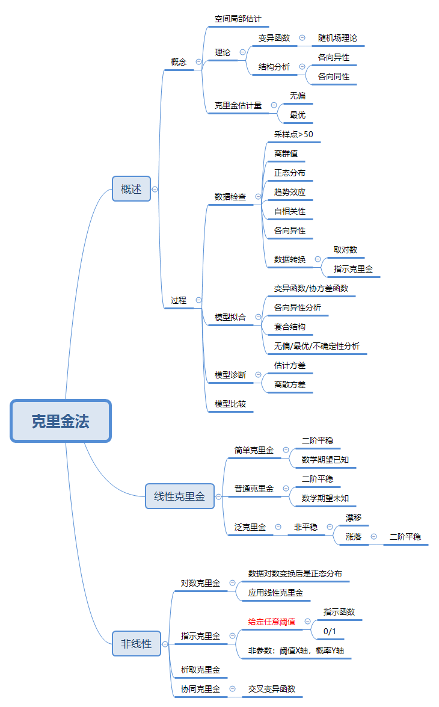

本章介绍了几种克里金方法如何对待求量进行插值。这一章基本上是地统计学理论部分的最后部分了，正好进行总结

#### 一、地统计的应用流程
- 拿到数据后首先对数据进行检查，如是否有离散值，是否符合正态分布（偏度为0，峰度为3），自相关性，趋势性等。
- 计算变异函数值或协方差函数值，选择合适理论模型进行拟合。
- 结构分析，建立合适的套合结构。到这一步变异函数模型建立完毕。
- 计算克里金估计量，及未知量和已知量之间的权重，求解标准：无偏性，最优性。
- 交叉验证。

#### 二、地统计学与反距离加权的异同
反距离加权方法只是单纯的认为各变量之间的变化由距离引起的，距离越远，各变量之间的相似性也小，因此属性值与距离成反比。
而地统计学方法，引入随机场理论后可以利用统计的方法对数据进行插值。它利用协方差或变异函数来表征由距离引起的各属性值之间的关系，这一关系不是指确定的距离关系，而是由统计得到的协方差来表示。为了能够通过距离变化来研究各属性值的变化，假定研究量二阶平稳，即属性的变化只与距离有关，而与位置无关。

以下为本章的思维导图：

[这篇](http://blog.sciencenet.cn/blog-1813407-863505.html)文章是《地统计学概论》的前言部分，写的很好。

