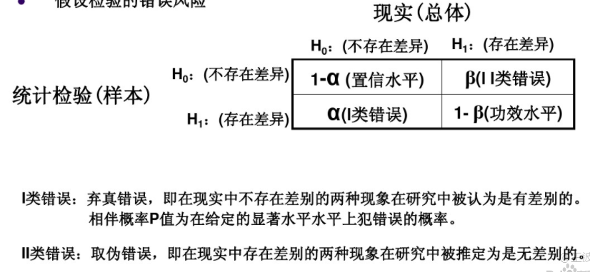
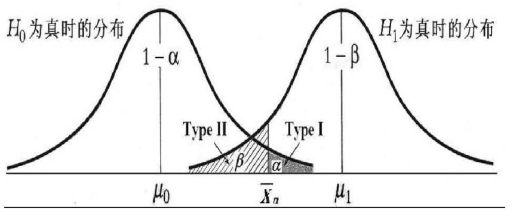

假设检验中经常被第一类错误、第二类错误搞糊涂。

通常来讲，第一类错误$\alpha$称为**弃真**，第二类错误$\beta$称为**取伪**。第一类错误和第二类错误并非互补关系，即$\alpha + \beta \neq 1$。犯第二类错误是第一类错误的条件概率 $\beta = P(H_0为真|H_0为假)$，则统计功效 = $1 - \beta = P(H_0假|H_0假)$

下图说明的很清楚：

决定统计效力的有如下几个量：
- 样本量
- 效应量(ED)，H0和H1的差异性
- 显著性水平$\alpha$，$\beta$是$\alpha$的条件概率

通过统计效力的计算公式可知，统计效力、样本量、效应量、显著性水平相互决定，确定其中三个可推出第四个量；因此，经常在给定显著性水平、统计效力、和ED的条件下计算最小样本量。

PS: 搜了好多网页，发现还是看论文来的全面。

参考文献
1. https://www.docin.com/p-1408327328.html
2. https://blog.csdn.net/xxzhangx/article/details/73141412
3. https://wenku.baidu.com/view/5bfff50676c66137ee061910.html?fr=search-1-wk_es_paddle-incomeN
4. https://zhuanlan.zhihu.com/p/20791562
